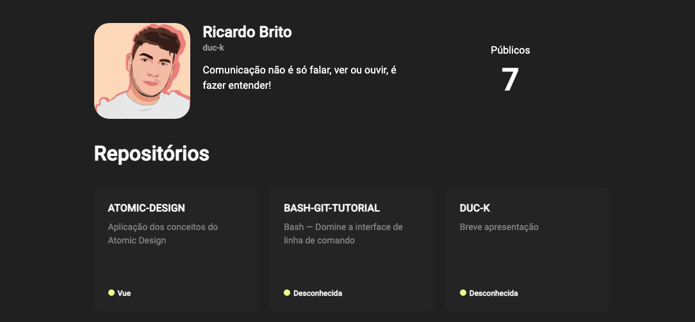
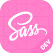

# Repohub



<br />
<br />

# Stacks

  

<br />
<br />

# 👯‍♀️ Clone

Faça o clone do repositório ou baixe o zip

```bash
git clone https://github.com/duc-k/repository.git
```

<br />

# 📦 Dependências

Instale as dependências

```bash
yarn
```

<br />

# 🚀 Execução

Execute a aplicação digitando o comando no seu terminal

```bash
yarn dev
```

<br />

# ⛵️ URL

Acesse abra a url no navegador

```url
http://localhost:8080/
```
